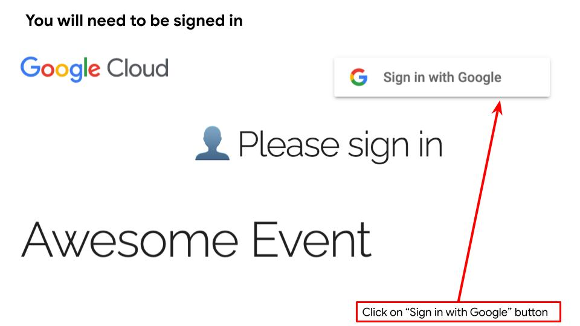
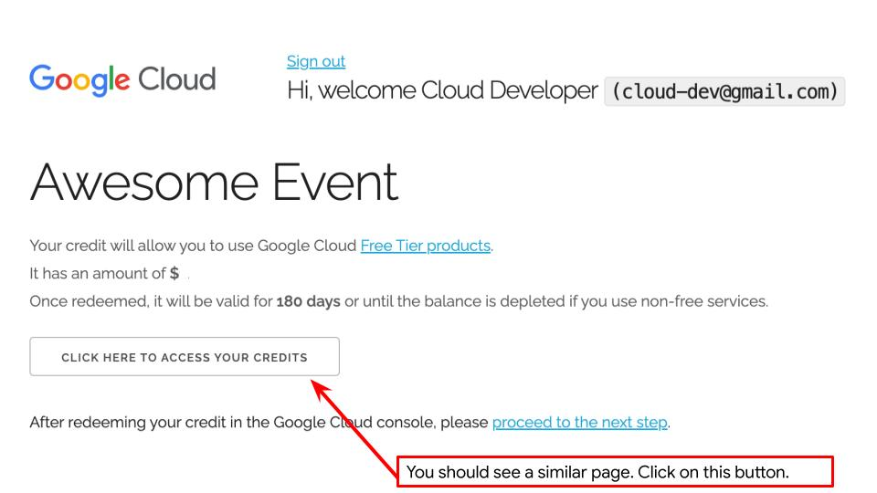
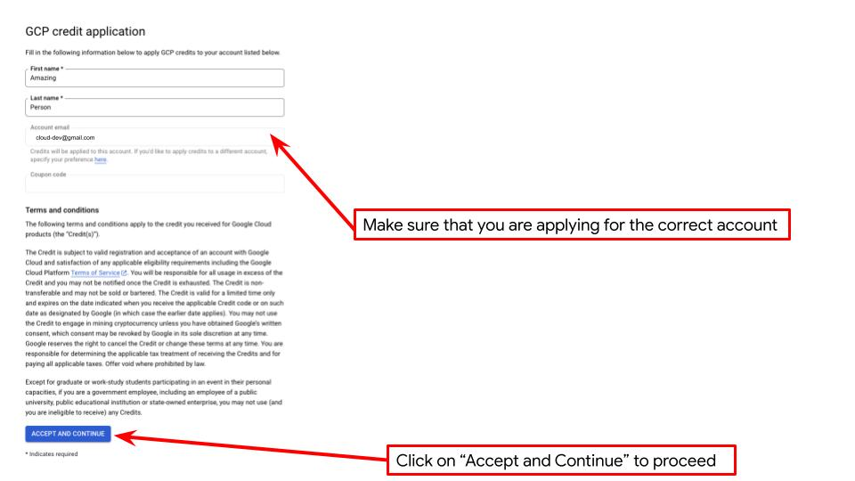
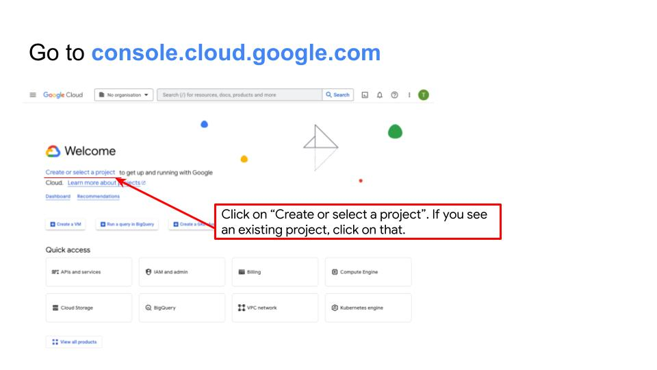
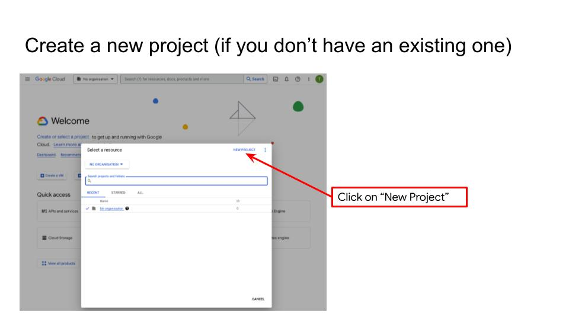
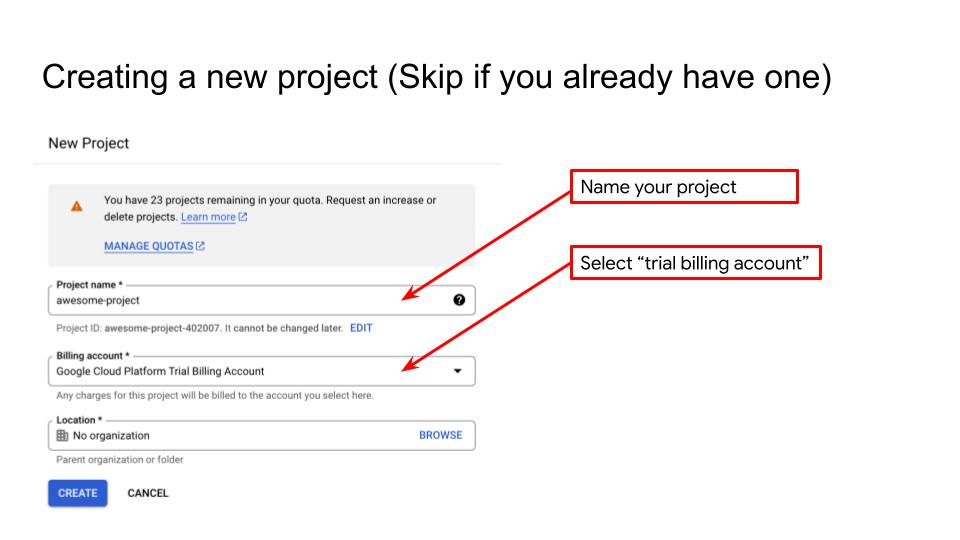
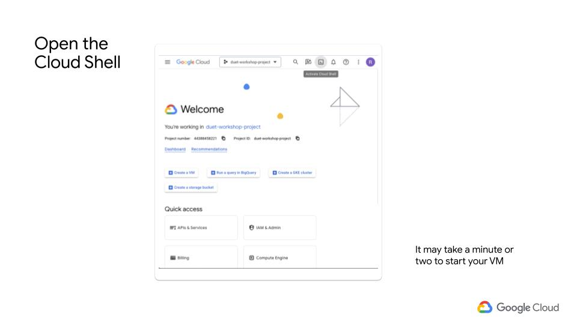
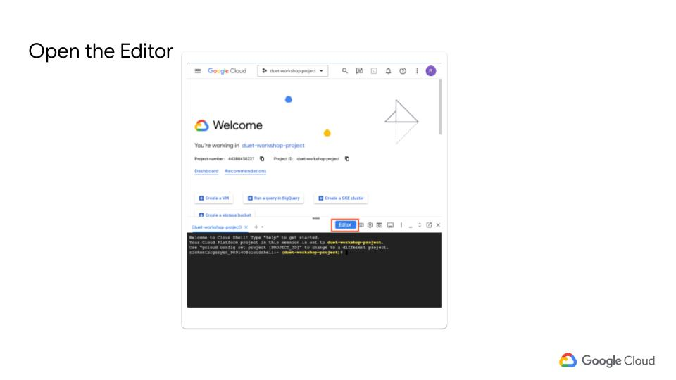

# Google Cloud Setup

## Create Google Cloud Account

1 - Open [Lab Environment](https://trygcp.dev/e/devnexus24) and Sign-In



2 - Click on "Click Here to Access Your credits"



3 - Click "Accept and Continue"



4 - Click on "Create Or Select a Project"



5 - Click "New Project"



6 - Name your Project. Select the Billing Account created previously. Click "Create"



7 - Click the Cloud Shell Button



8 - Open Editor. This step might take few minutes



9 - Enable Needed API's

Open a Terminal Window and run the following commands

```
gcloud services enable artifactregistry.googleapis.com
gcloud services enable container.googleapis.com
gcloud services enable run.googleapis.com
gcloud services enable secretmanager.googleapis.com
```

The rest of the steps will be executed from this environment unless instructed otherwise.
